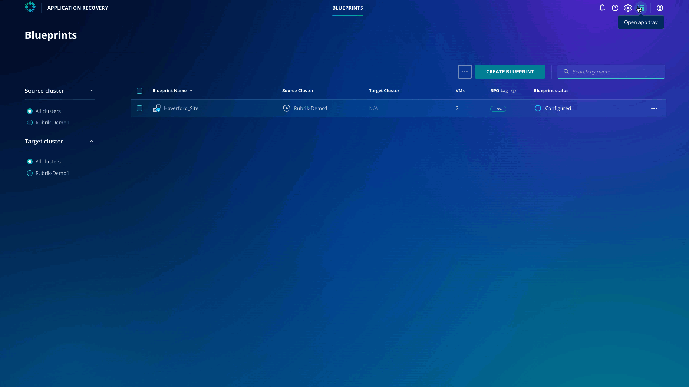

# Accessing Data Security Command Center

## Data Security Command Center
Data Security Command Center (DSCC) is a SaaS service that provides visibility into an organization’s data risks and security gaps, as well as offers recommendations to improve overall security posture. It radically simplifies data risk management by using a single control plane for global visibility and collaboration.

## Accessing Data Security Command Center
If you haven't already connected to the Rubrik Security Cloud, head back to the [lab environment](../lab_environment/lab-0.md).

Once you're logged in, click the app-tray icon in the top right of the user interface, then select Data Security Command Center.

As you can see, DSCC presents an overall score with 4 pillars: Platform Security, Data Protection and Recovery, Ransomware Investigation, and Sensitive Data Discovery with individual metrics. The collection of scores across the pillars is combined to provide an overall data security score which serves as a single source of truth for the entire Rubrik data environment. 

You can now explore each pillar to understand how to improve the security posture.