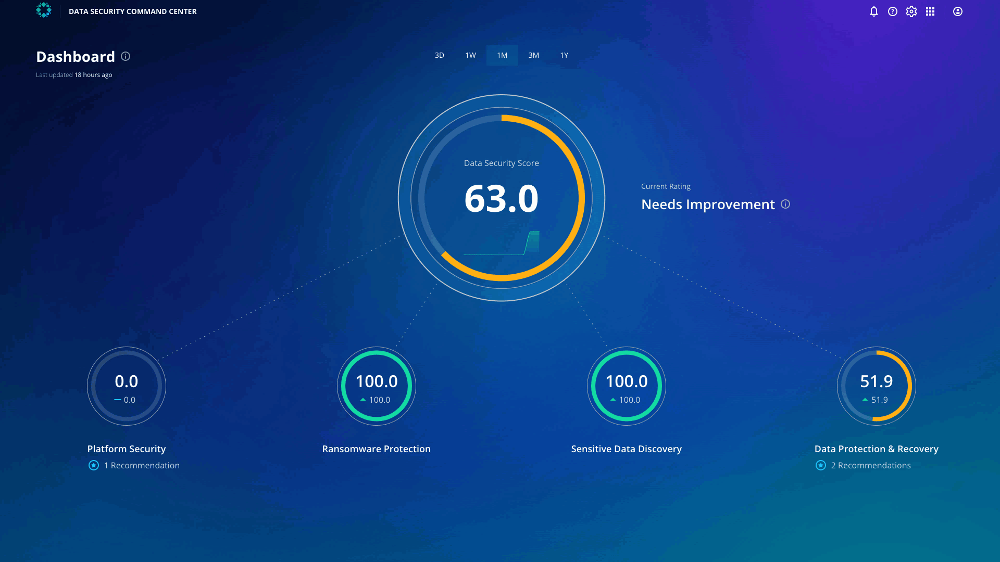

# Platform Security

Click **Platform Security** under the overall score. The score is 0 right now. On the right side, you can see all the recommendations to improve the score. 

Currently, the recommendation is to enable Multi-Factor Authentication with Time-based One-Time Passwords. 

You can also access the Rubrik support article to enable the recommendations as well. 

