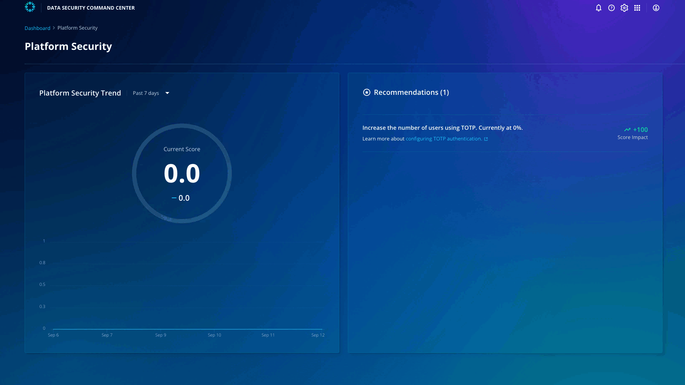

# Ransomware Protection

Click **Dashboard** on the top left and click **Ransomware Protection**. 

You can see that the score is 100. 

Now that you have enabled all the clusters to perform the anomaly scan, ransomware and its blast radius can be detected quicker. You can track the score trends based on 1 week, month, or year.