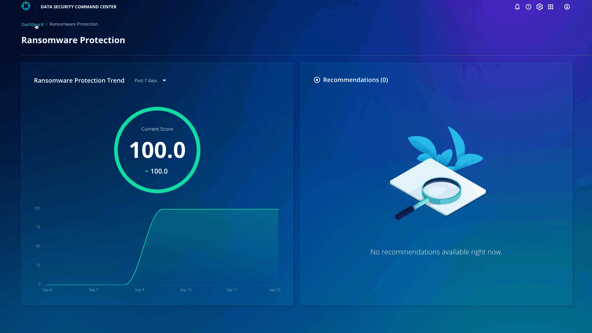

# Sensitive Data Discovery

Click **Dashboard** on the top left and click **Sensitive Data Discovery**.

You can see that the score is 100. 

Now that you have enabled all the clusters to perform Sensitive Data Discovery, you can understand the location of your sensitive data along with who has access to this, especially when determining what data has been exploited during attacks.