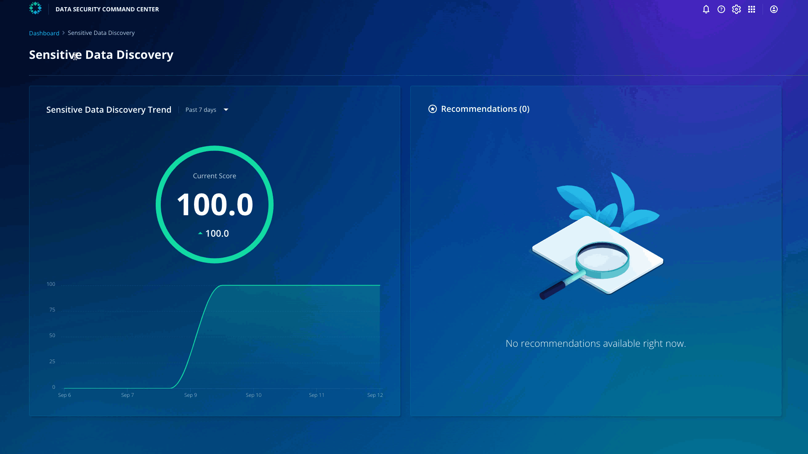

# Data Protection and Recovery
​
Click **Dashboard** on the top left and click **Data Protection and Recovery**.

You can see that the score is 51.9. You can also see the recommendations on the right to improve the score. 

::: tip Note
1. While Rubrik provides multiple defense layers against attackers, you can now understand that risk management processes aren’t static and must be continuously monitored and reported on to identify and assess risk within the environment.

2. DSCC doesn't just provide you with a score, it provides actionable insights into how to improve your security posture.
:::
​