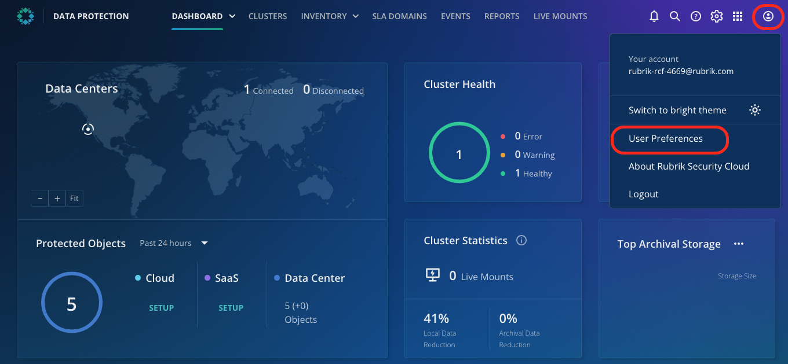
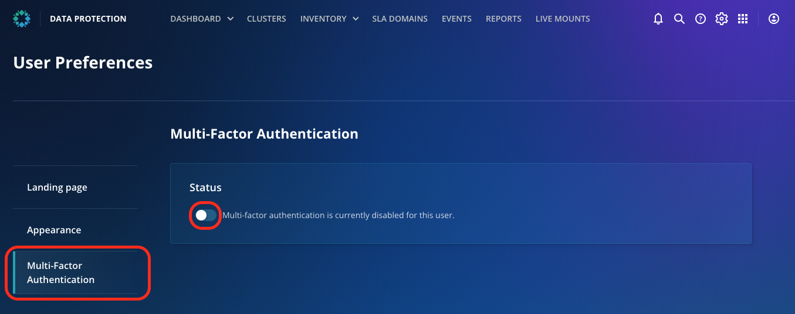
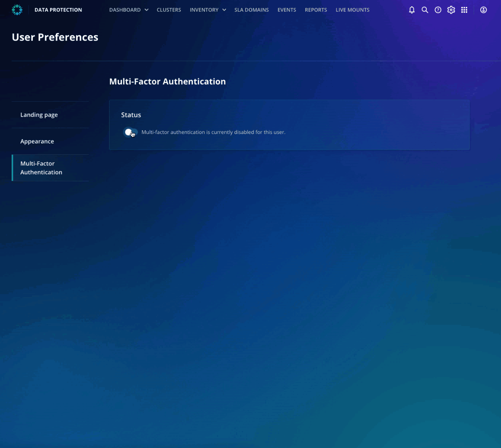
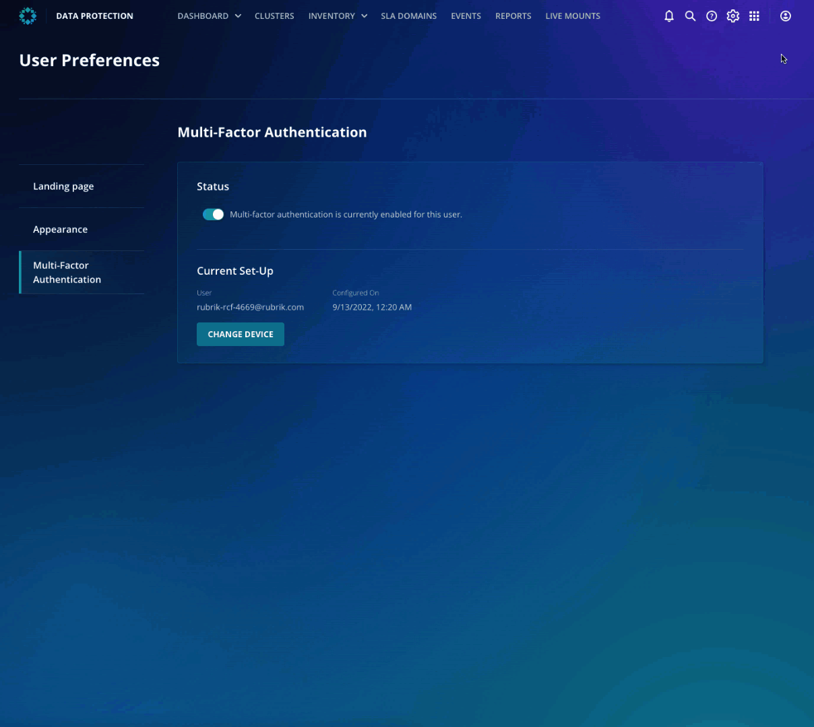

# Multi-factor Authentication (MFA) with Time-based One-Time Passwords (TOTP)

Now that your environment is up and running and you have some insight into the security score let's set up MFA with TOTP for the user to add an additional layer of security to avoid any unauthorized access to the environment. 

::: warning Note
Please **download** and configure one of the following **third-party authenticator** applications **on your phone** to enable a Multi-factor Authentication or two-step verification configuration. 
- Google Authenticator
- Microsoft Authenticator
- Okta Authenticator
If you already have one on your phone, feel free to use it by adding a new Organization.
:::

 1. Under the user icon, click **User Preferences** and navigate to Multi-factor authentication.

2. Toggle the button to turn on Multi-factor authentication, as it is currently disabled for this user

3. Open the Authenticator on your phone and add an Organization or scan a QR code.

4. Enter the code from your Authenticator app into the **Verification Code**. Click **Continue**.

5. Under the user icon, click Logout. Re-login to RSC, and now you can enter the TOTP as the verification code from your authenticator application. 

::: tip Note
Rubrik MFA provides an additional authentication security layer. In addition to the username and password, TOTP uses an app to deliver a single-use numeric code as the second authentication factor.
:::