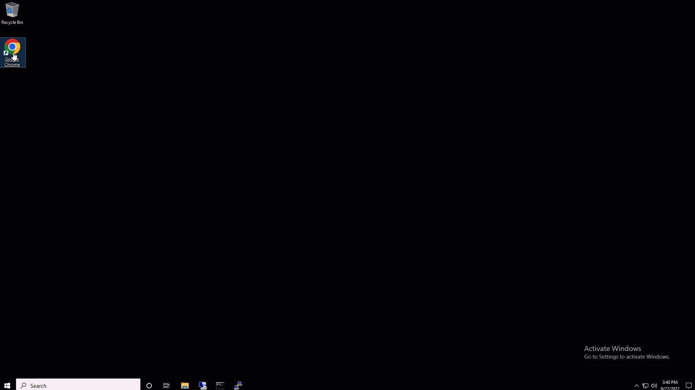

# Lab environment

::: danger WARNING
 This is a virtualized lab environment. All systems are running with nested virtualization. This being the case, no expectation for performance should be assumed while using this lab, nor should you consider this lab reflective of the performance expected in a production deployment. **This lab is for demo and educational purposes only.**
:::

The Rubrik lab environment consists of multiple cloud-hosted virtual machines used to emulate the web application and protection of the Zaffre fashion group.
- **AD1** = Windows VM for Active Directory, DHCP, and DNS services covering both virtual sites in the rubrik.lab domain.
- **ESX1** = This is an unmanaged (no vCenter) virtual ESXi Host used to host the Rubrik Edge CDM instances supporting this lab. You should not need to interact with this host through the consoles.
- **VC1** = These are the ESXi Hosts that contain the test Linux VMs and the vCenter instances supporting each virtual data center.
- **Jump** = This is the VM where you will interact via browser with the lab's various components.
- **Startup** = This VM hosts all of the automation used to provision this lab. You may ignore this VM and should not need to interact with it at all. **It should remain powered off.**

These serve as the infrastructure for the Zaffre Fashion Group and Haverford websites.

## Accessing Rubrik Security Cloud

To connect to the Rubrik Security Cloud, start the Google Chrome browser from the jump host. Click on the **Lab Credentials** bookmark. This bookmark contains the Rubrik Security Cloud URL, username & password for all required hosts.
::: tip Note
Rubrik Security Cloud is referred to as Rubrik in the credentials bookmark. Please use the copy button for username and password.
Note that the lab guide name will reflect this lab, not necessarily the name in the image below.
:::

From here, right-click and open the Rubrik hyperlink. Enter the specified username and password by copying both from the Lab Credentials page. Click on **I AGREE**. On the next screen for Enable Multi-Factor Authentication, click on **SKIP FOR NOW**. 

Enter **Demo** as the username, first name, last name, title, and company. For email, enter **demo@xyz.com**.

::: tip Note
Reduce the zoom to 75% in your Chrome environment for the lab to be most easily accessible.
:::