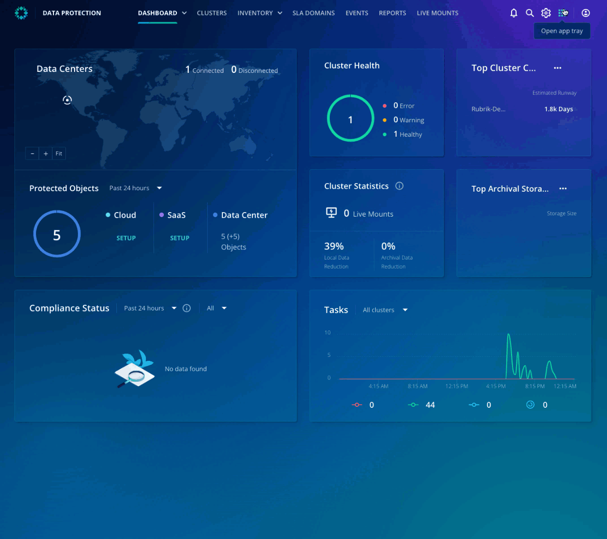

# Accessing Orchestrated Application Recovery

## Orchestrated Application Recovery

Orchestrated application recovery is delivered as a Rubrik Security Cloud-based application. It provides orchestration of DR failover/failback, testing, and together with application-focused Ransomware Investigation, which will radically simplify recovery for business services running in VMware vSphere environments. As a result, IT organizations can eliminate multiple-point solutions and management complexity and avoid unnecessary costs.

## Accessing Orchestrated Application Recovery

If you haven't already connected to the Rubrik Security Cloud, head back to the [lab environment](../lab_environment/lab-0.md).

Once you're logged in, click the app-tray icon in the top right of the user interface, then select **Application Recovery**. 

