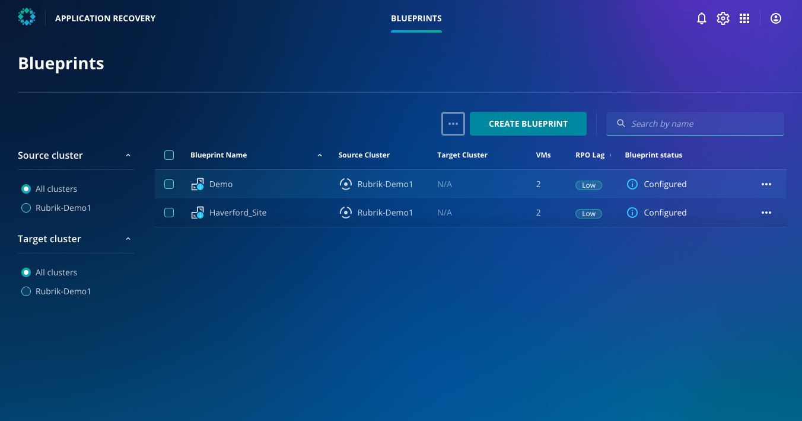

# Blueprints

## Intro to Blueprints

Orchestrated Application Recovery uses the concept of Blueprints to bundle together the virtual machines that make an application. Doing this makes it easy to recover the workload without needing to worry about which virtual machines need to be restored and to which point.

From the Orchestrated Application Recovery, you can now access the Blueprint called "Haverford Site," which is made up of 2 VMs. 

You will initiate the in-place recovery next. 