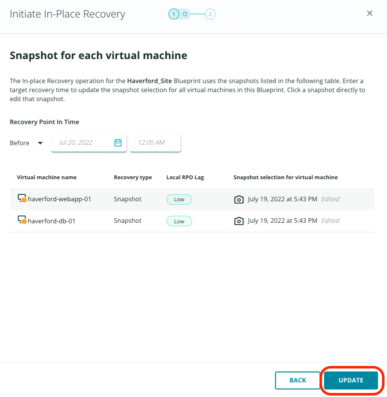

# In-Place recovery
Zaffre has the Rubrik Enterprise Edition suite, and now you will leverage the deep integrations to kick off an in-place recovery.

To do this, first switch to the **Ransomware Investigation** app in the app-tray in the top right of your screen.

Click the **Investigations** tab in the top center of the screen. You can see the Haverford_Site blueprint from Orchestrated Application Recovery. 

From here, you can see clearly that there is suspicious activity, particularly on the **haverford-webapp-01** virtual machine. Check the box to select the **Haverford_Site** blueprint, then click Recover.

::: tip Note
Notice that when you select the app, you are also able to download a CSV detailing all suspicious activity detected in the component virtual machines.
:::

You can notice that this defaults to recovering the VM to the closest snapshot to the point in time that you've selected. As Zaffre is recovering from a ransomware attack, it's important that a clean recovery point is selected. 

Click the Edit button for the blueprint.

You need to find a clean snapshot.

Click "Select a snapshot" for the first VM. 

You should notice the details when the first anomaly was detected, along with suspicious/added/modified/deleted activities. You will also see one (or potentially multiple) snapshots have a yellow circle with an exclamation mark - these snapshots are considered to be unsafe recovery points, so select the snapshot immediately prior to this. Click Save, then do the same thing for the second VM.

::: warning Note
Depending on how long ago the labs were pre-provisioned, the snapshot with anomaly and the good snapshot may be on the second page. 
:::

Click Update. You may notice options to enable agent-based reconfiguration and ignore network reconfiguration errors and continue. Click Update to proceed.

Click Next. You'll now see a warning. As in-place recovery overwrites the existing virtual machines, you have a final check to prevent accidental clicking: click into the free text field and type BLUEPRINT. Once this is done, the Recover button is clickable.

You can now see that the recovery has begun and can track the progress on the Recoveries dashboard. Click the button to Go To Recoveries.

::: tip Note
The recovery activity may take a moment to be shown under Recoveries.
:::

Monitor the failover through to completion. This may take a few minutes. Once the recovery is successfully completed, you need to validate that the Haverford website is back up and running. 

Open a new tab in your browser, and click the shortcut to the Haverford site.  You should see it is back up and running.

<iframe title="vimeo-player" src="https://player.vimeo.com/video/716514475?h=eaf817797f&title=0" width="640" height="360" frameborder="0" allowfullscreen></iframe>
Congratulations!

::: tip Note
Using Orchestrated Application Recovery and few clicks you got Haverford up and running within the hour vs. days or weeks!
:::