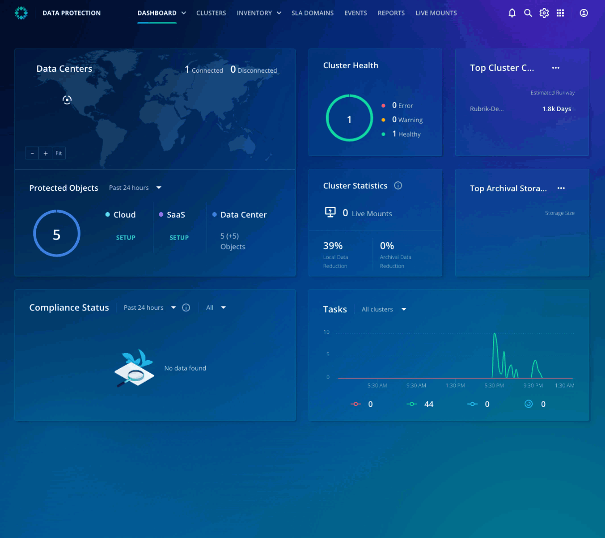

# Accessing Ransomware Monitoring & Investigation

## Ransomware Monitoring & Investigation

As **Rubrik collects each backup snapshot’s metadata**, it leverages machine learning to build a perspective of what is going on with the workload. The model is trained to identify trends that exist across all samples and classify new data by their similarities without requiring human input. The result is that Ransomware Investigation detects anomalies, analyzes the threat, and helps accelerate recovery with a few clicks. 

Ransomware Monitoring & Investigation is available in the Rubrik Security Cloud as an application. 

## Accessing Ransomware Monitoring & Investigation

If you haven't already connected to the Rubrik Security Cloud, head back to the [​lab environment](../lab_environment/lab-0.md).

Once you're logged in, click the app-tray icon in the top right of the user interface, then select Ransomware Investigation.

