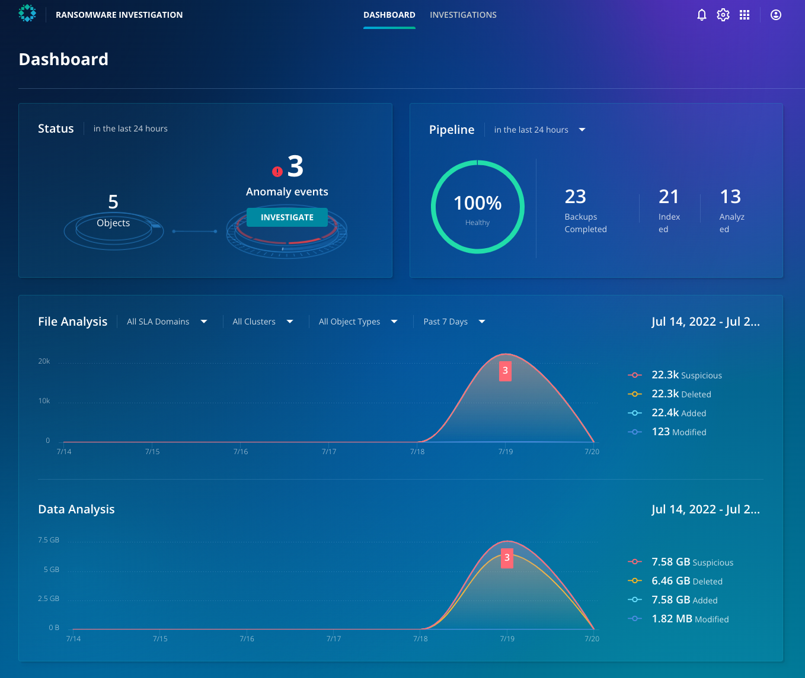

# Visibility into the attack

From the Ransomware Monitoring & Investigation dashboard, you can see the critical events that were discovered over the past 24 hours. The Status card displays the number of anomalies detected in the last 24 hours on the top-left row.

::: warning
Depending on how long ago the labs were pre-provisioned, the Anomaly events may not be visible in the Status section.
:::

Next, on the top-right row, the **Pipeline card** displays the overall success of backup, indexing, and analysis jobs in the last 24 hours. You can click on each job type to view details on the **Events** page.

The **File Analysis** and **Data Analysis** cards give you an overview of the systems, files, and amount of data impacted by the cyber events over the last seven days. 

::: tip Note
Without any deep introspection, you now know the scope of the problem in the production environment. Let's dive in, and get more granular.
:::

Click on the **Investigations page** in the banner on the top.  