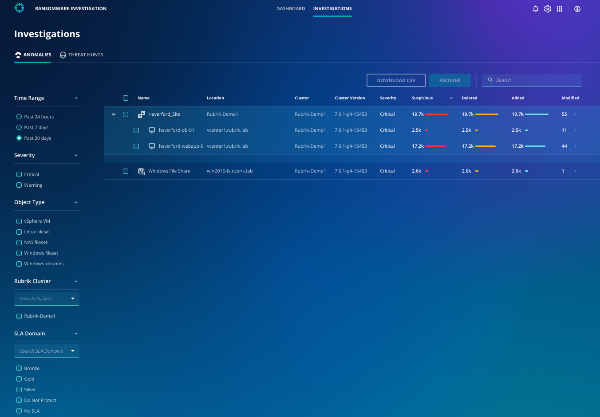

# Investigations page

Ransomware Investigation has a dedicated page that lists potential anomalous incidents with their location, cluster, file details, and snapshot time. If you have Orchestrated App Recovery (discussed in a later section) enabled, objects that are part of a blueprint will be grouped under that blueprint.

By looking at this page, you now have an understanding of which systems and applications have been affected by the cyber attack. 

Now, let's dive deeper into which folders and files are impacted. 
​