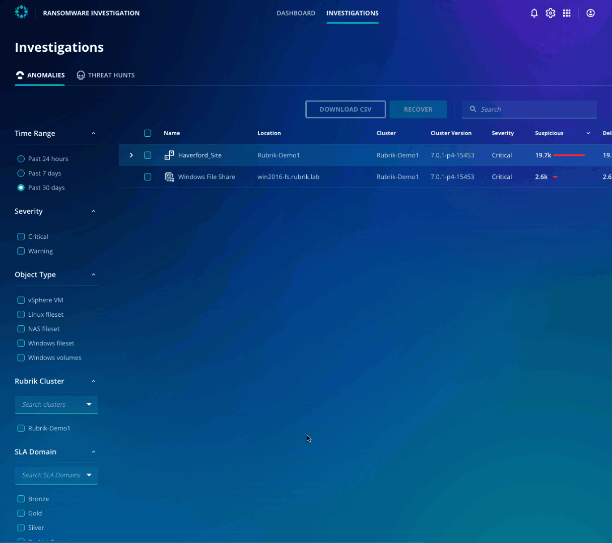

# Instant file recovery
Many ransomware recovery plans are based on restoring entire VMs. A ransomware attack doesn’t encrypt every file, so customers shouldn’t need to restore every file to recover. Normal day-to-day business functions routinely change data. These changes are coordinated across multiple files, databases, or even VMs.  If you restore files that weren’t affected by a ransomware attack, you may lose transactions or even get out of sync with other systems.

A far better approach would be to incorporate a multi-layered approach such as Rubrik’s instant file recovery into a recovery plan that can make it easy to recover only what you need.

Let's discuss how Zaffre can take advantage of this. The IT team can navigate to **Haverford_Site > haverford-webapp-01 > var > www > html > wp-content > plugins** folder as explained in the previous Ransomware Investigation lab section.

Select all the rows files on the page by selecting the box in the top row next to **Name**. After selecting the files, notice that the **Recover** button becomes available. Click on **Recover** and observe the various options available to recover the files.

For now, exit out of the recovery option. We will perform the recovery in a later section.  

::: tip Note
With Rubrik, multiple options for instant file recovery are available at your fingertips!
:::