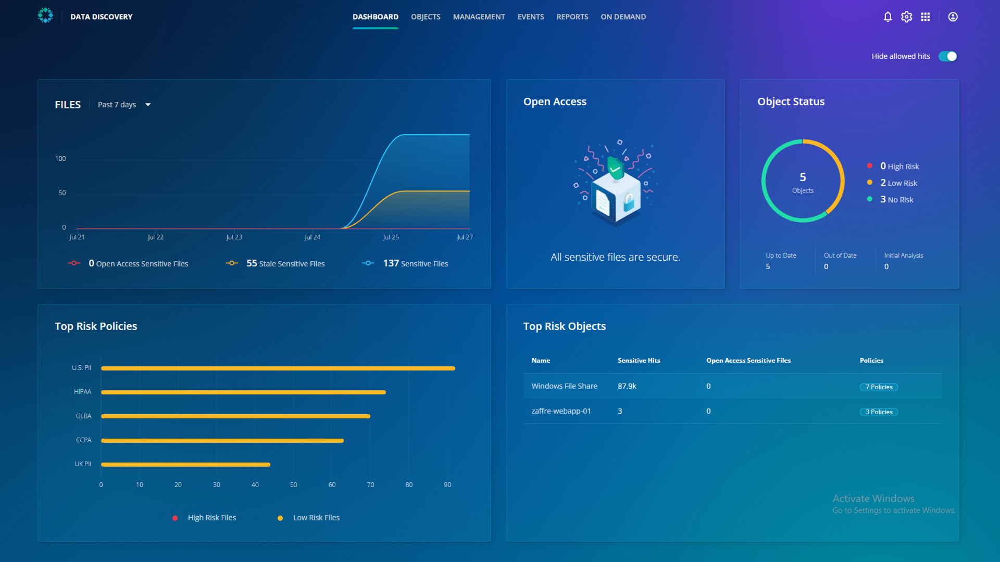

# Visibility into sensitive data

From the Data Discovery dashboard, you can see at a high level what the tool has discovered. On the top row, we can see a summary of all the sensitive files over the past 7 days. 

Next, on the top right, the **Open Access** card displays the summary of files with open access. You can click here to get info on sensitive data stored in files with no access restrictions.

The bottom row with the **Top Risk Objects** card displays the top hits by policy and the top risk objects to you.

::: tip Note
Without any deep introspection, you can now know the scope of access to sensitive data.
:::