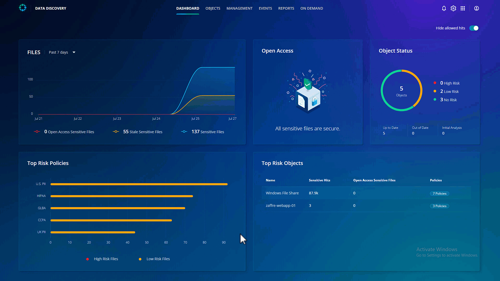
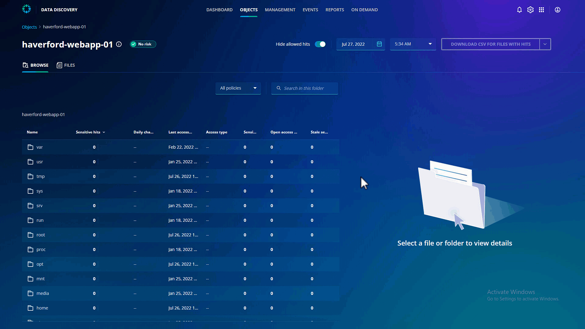
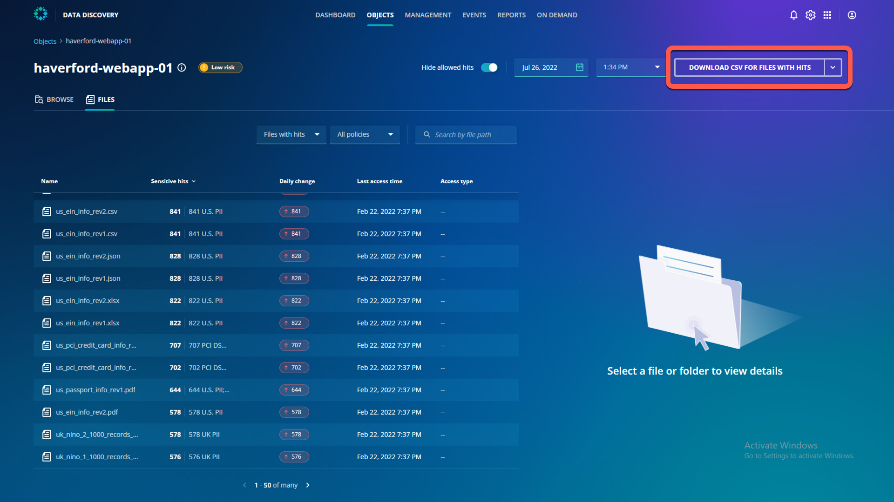

# Cyber incident response

By accessing Ransomware Investigation & Monitoring app, you have already established the timeline for the cyber attack. You are already aware that the attackers have encrypted files for Haverford. The legal team would like to know what kind of sensitive information the attackers have access to and encrypted.

To get started, navigate to **Objects** from the top ribbon. Click **haverford-webapp-01**. Click Sensitive hits to change the order from ascending to descending. You will observe that there are 0 sensitive files at this moment. 

Now let's change the snapshot to before the attack. From the dropdown menu for time, select the 1st snapshot.

You can see that there were sensitive files present in the var folder, which the attackers now encrypted!

You can download the list of files with hits by using the **Download CSV For Files With Hits** button on the top right. 

Now you have provided the legal and compliance team with the ammunition to get to the bottom of the data access issues. 

::: tip Notes
- With Sensitive Data Monitoring, there is no additional lift to get access information. 
- There is no impact on production data or the performance of the system.
- The same app can scan 10-100's objects that are protected by Rubrik.
::: 