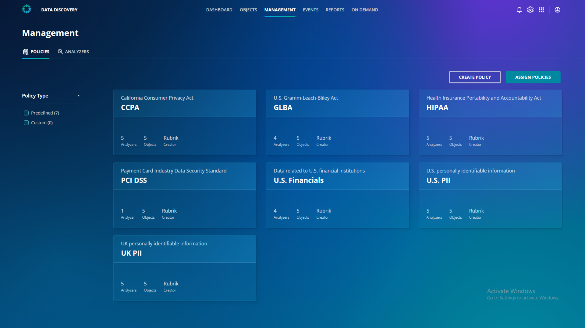

# Policies

You've now seen that Sensitive Data Discovery & Monitoring can help identify where sensitive data resides in your environment during war and peace. You may need to keep track of many different types of data, and Rubrik ships with a number of policies available out of the box to search for these. Click on the **Management** tab at the top of the dashboard.

Policies define the data types you want to identify, and they're built from one or many Analyzers.

You can click through one of the predefined policies to see which objects are covered by this policy or which Analyzers are used by this policy. 

You can click back to the Management tab at the top of the screen to look at the building blocks of policies: Analyzers.