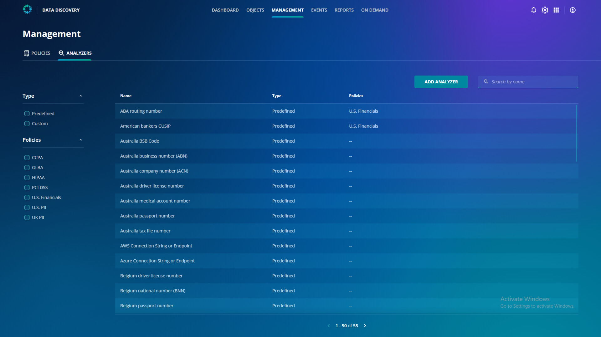

# Analyzers

On the left side of your screen, click the Analyzers tab. You can see all of the predefined analyzers that Rubrik includes.

​
As you can see, there are multiple predefined analyzers, and Rubrik keeps adding new ones quite frequently. 

::: tip Remember
Although Sensitive Data Discovery & Monitoring is a SaaS service that is managed in the cloud, the data scanning occurs on your CDM cluster, so no data ever leaves your control.
:::