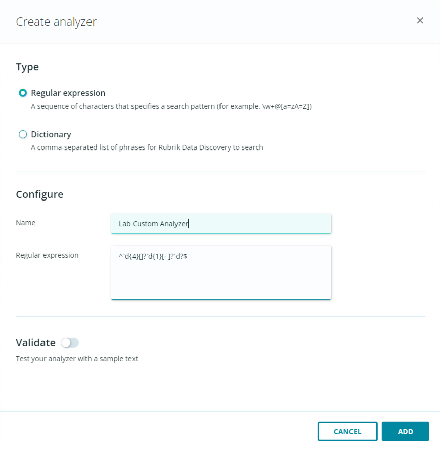
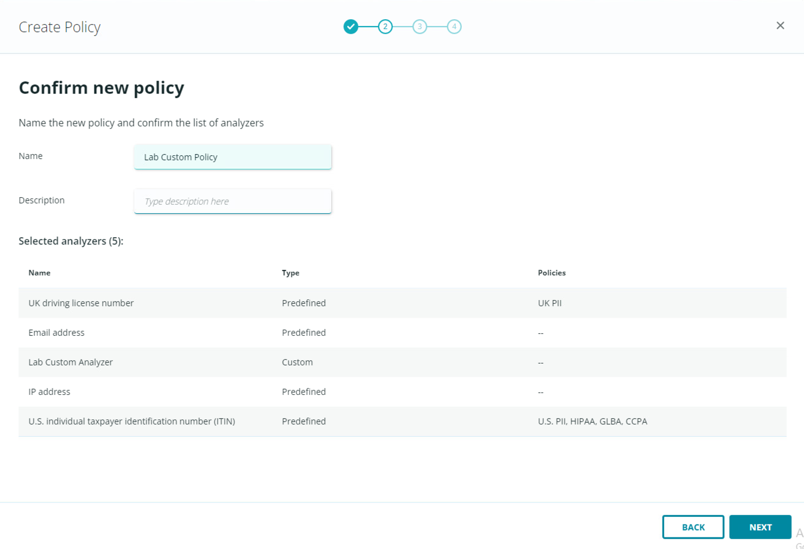
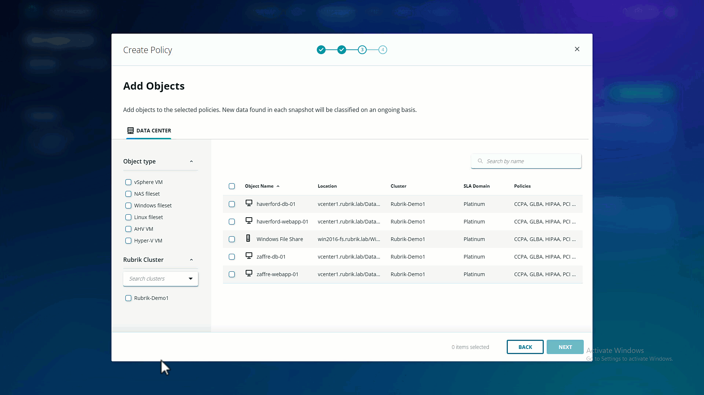

# Custom analyzers & policies

Every business is different and has different needs, so Rubrik also provides you with the tooling to build your own Analyzers and Policies. Let's take a look at how that works.

Click **Add Analyzer**. Select to specify the patterns that you're looking for using either a regular expression or a dictionary; specify what you're looking for (either the regex or set of dictionary words), for example: **^\d{4}[]?\d{1}[- ]?\d?$** and give your Analyzer a name. Click Add.

You now see your newly created custom Analyzer in the list for selection, but you'll notice that it's not associated with any policies. Click back to the Policies tab to add a new, custom Policy and tie your custom Analyzer in.

Click **Create Policy**. Select any number of Predefined analyzers, as well as your Custom analyzer, then click **Next**.

Name your policy, and optionally add a description. Confirm that you're using the Analyzers that you want to use, then click **Next**.

Select the objects that you want to scan with this new policy. In this lab, all objects are vSphere VMs but notice the other object types that can also be scanned. Check the boxes for each object that you wish to scan. Select the Rubrik-Demo1 cluster, then click Next.

Confirm that the objects you wish to scan with this new policy are correct, then click Confirm. A complete initial analysis will automatically take place on the objects you specified, in line with the newly defined custom Analyzer and Policy. Progress of this scan can be monitored on the Policies dashboard. 

This might take a short while, so move on to the next section - you can come back and check on this later in the lab.

