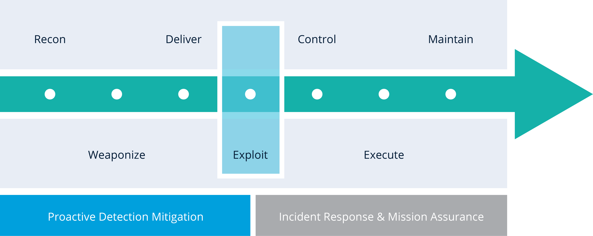

# Identifying the entry point of an adversary

Rubrik Threat Monitoring & Hunting provides the ability to scan across points in time. Not only can you scan multiple points in time for a single server, but you can also scan across your entire environment. This allows you to determine exactly when and where an Indicator of Compromise was first seen.

While every attack is unique, the MITRE Cyber Attack Lifecycle shown above maps the overall pattern. As you can see, there's a period of time between the point that the bad actor gains runtime in the environment (the Exploit) and the point of Execution (when the payload is activated: for example, when files start to be encrypted in a ransomware attack). When recovering from an attack, it is vital that you not also recover the initially exploited state, leaving the door open for the adversary to execute their payload again. 

Once you know the Indicators of Compromise, Rubrik Threat Monitoring & Hunting can search through time and space to identify your clean recovery point. In this way, you can surgically recover with confidence.