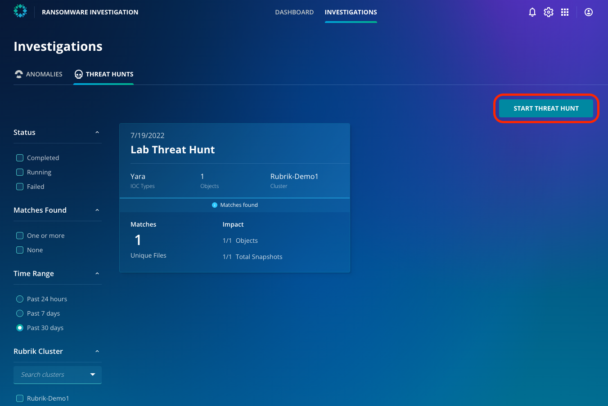
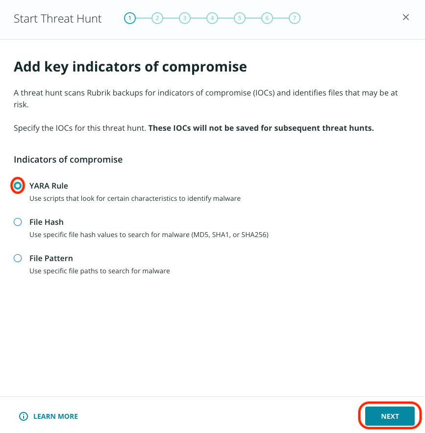
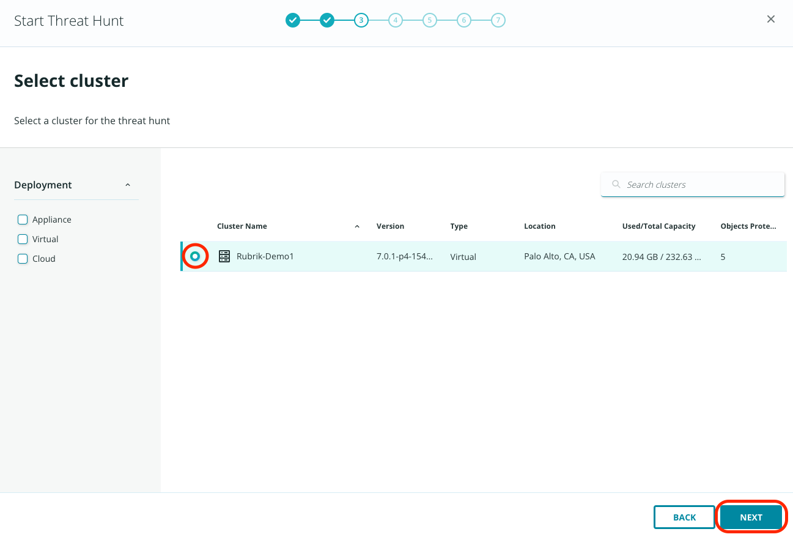
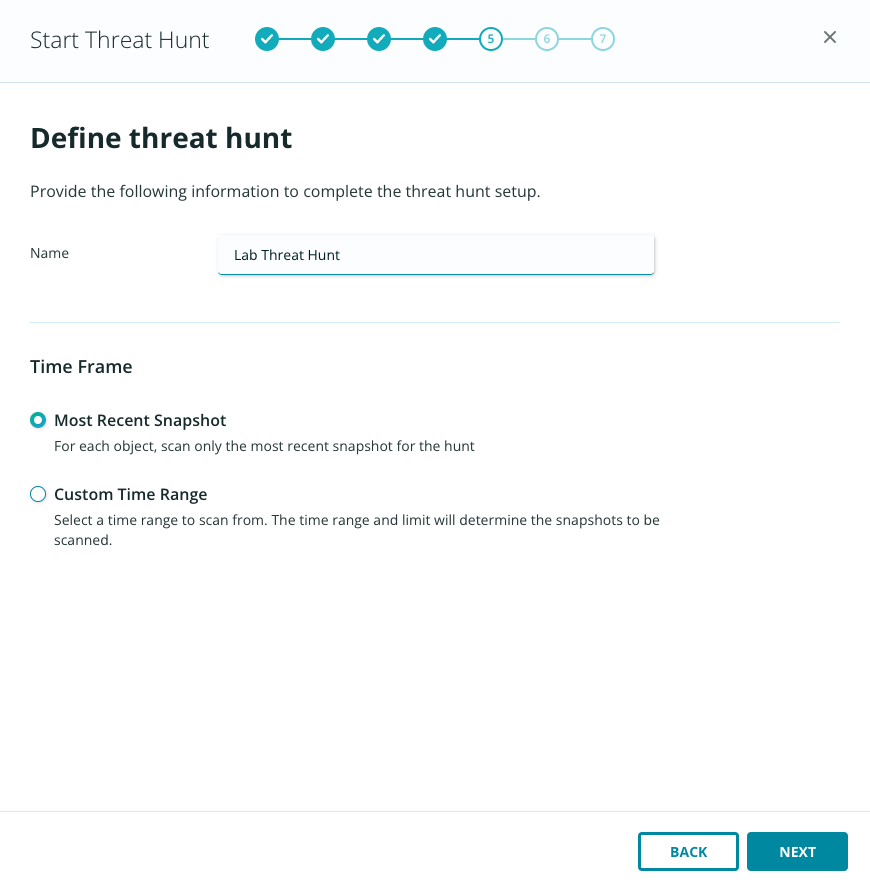
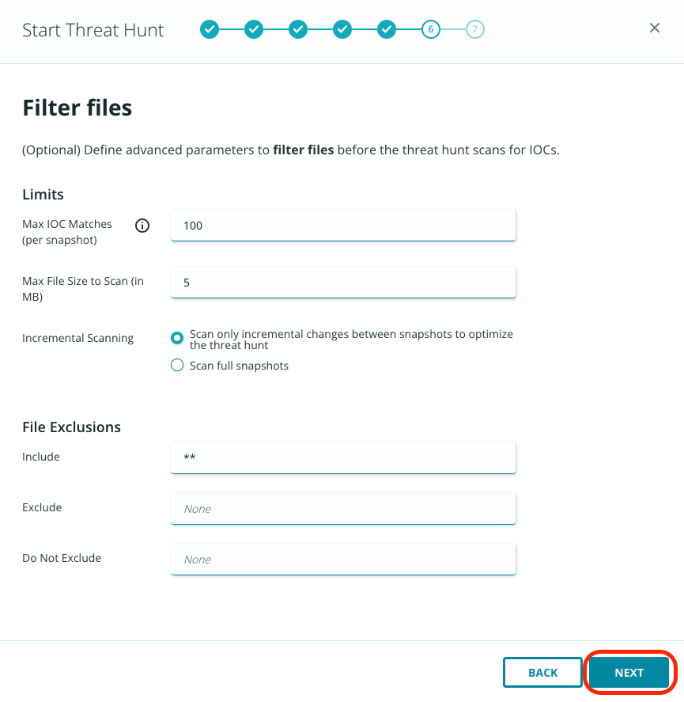
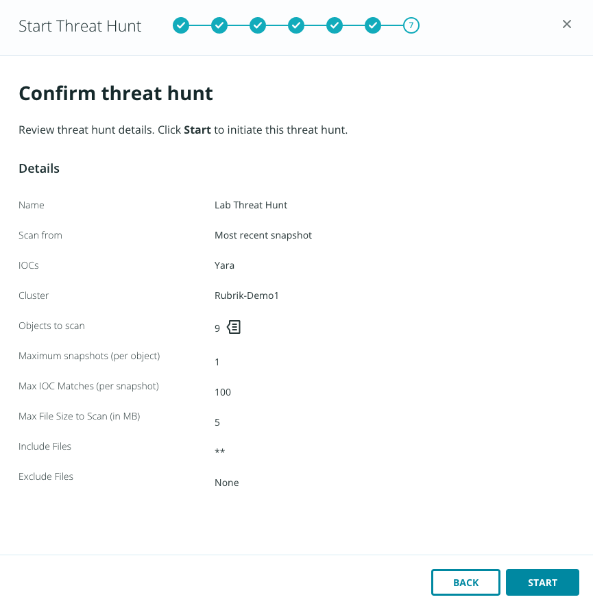

# Building a threat hunt

#### Time to build a threat hunt, so you can find the entry point of the adversary!

## Accessing Threat Monitoring and Hunting
If you haven't already connected to the Rubrik Security Cloud, head back to the [lab environment](../lab_environment/lab-0.md).

Once logged in 

- Click the app tray in the top right 
- Launch **Ransomware Investigation**
- Click the **Investigations** tab 
- Browse to the **Threat Hunts** tab


From this window, we can start to build out our threat hunt. 

- Click **Start Threat** Hunt to launch the wizard. From here, you define the criteria for your hunt. You can specify a fully-fledged YARA rule, or you can specify a file hash (such as md5, sha256) or file pattern (such as a path or paths or a specific file extension). 



- Select **YARA Rule** 
- Click **Next**. 



- You now specify a YARA rule. The rule provided by the Zaffre team is sourced from the open-source infosec community and can be seen below.

```YARA:no-line-numbers
rule eicar_av_test {
    /*
       Per standard, match only if entire file is EICAR string plus optional trailing whitespace.
       The raw EICAR string to be matched is:
       X5O!P%@AP[4\PZX54(P^)7CC)7}$EICAR-STANDARD-ANTIVIRUS-TEST-FILE!$H+H*
    */
​
    meta:
        description = "This is a standard AV test, intended to verify that BinaryAlert is working correctly."
        author = "Austin Byers | Airbnb CSIRT"
        reference = "http://www.eicar.org/86-0-Intended-use.html"
​
    strings:
        $eicar_regex = /^X5O!P%@AP\[4\\PZX54\(P\^\)7CC\)7\}\$EICAR-STANDARD-ANTIVIRUS-TEST-FILE!\$H\+H\*\s*$/
​
    condition:
        all of them
}
​
rule eicar_substring_test {
    /*
       More generic - match just the embedded EICAR string (e.g. in packed executables, PDFs, etc)
    */
​
    meta:
        description = "Standard AV test, checking for an EICAR substring"
        author = "Austin Byers | Airbnb CSIRT"
​
    strings:
        $eicar_substring = "$EICAR-STANDARD-ANTIVIRUS-TEST-FILE!"
​
    condition:
        all of them
}
```

::: tip Note
Use the copy button to copy the entire YARA rule and the paste it in RSC.
:::

This YARA rule searches for a string based on a regular expression (which Rubrik stores as $eicar_regex), identifying the commonly used EICAR virus test file. 

::: tip Note
That for the purposes of this lab, the hunt is for a benign target and demonstrates the capabilities of this feature **without** unleashing malware into the lab. In the real world, you're probably searching for something malicious!
:::

- Once pasted the above rule into the field, click **Next** 
- Select the **Rubrik-Demo1** cluster by checking the radio button 
- Click **Next** to continue



- Check the box to select all objects protected by the cluster, then click **Next**. 
- Give your search a name, then select a timeframe for the search - either the most recent snapshot, or specify start and end dates to scan a time range. If you opt for the latter, you can also limit the number of snapshots scanned per object to complete the hunt in a shorter timeframe. For this lab, you may opt for either option on this screen. Click **Next**.
- On the next screen, you can apply filters to be more specific with your hunt. The more specific you can be, the quicker the hunt will complete. You can leave these as defaults in this lab. 



- Click **Next**.
- You can add file exclusions, file size, etc., on this page. For now, leave them as default. Click **Next**.



- Review your Threat Hunt parameters, then click **Start** to begin the hunt.

