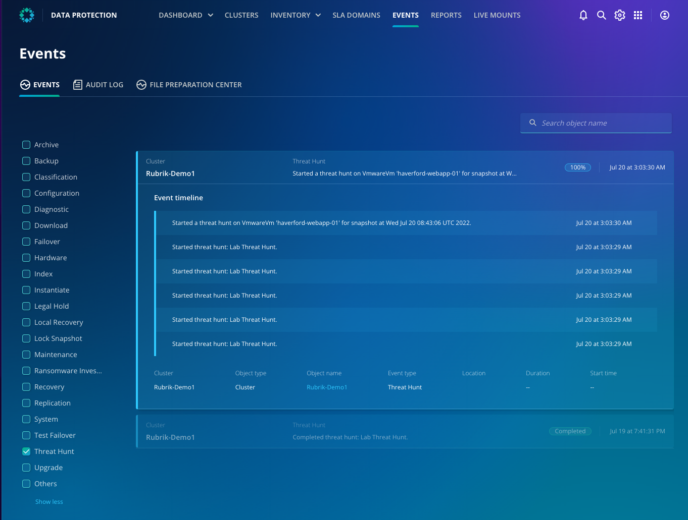

# Monitoring a threat hunt in progress

::: tip Note
That this page is optional - if you are short on time, please feel free to move on to the next page, where we explore the results of a threat hunt that is already completed.
:::

At this stage, the definitions of the Threat Hunt are pushed down from the Rubrik control plane, down to the CDM cluster. The Rubrik control plane has no access to the data in the backups, and so the scan is executed on the appliance on-premises (or in the cloud, if using Cloud Cluster).

You can monitor the progress of the threat hunt in the Events tab in Data Protection. 
- From the app-tray in the top-right of the interface, launch **Data Protection**
- Click on the **Events** tab
- In the filter field, Select **"Rubrik-Demo1"** from the Clusters section and select **Threat Hunt** from the **Event Type** section.
- It may take a minute or two for the hunt details to appear, as they are first composed on Rubrik, then pushed down to the cluster for execution

After a few minutes (dependent on the parameters that you specified for the hunt), you should see the hunt move to Completed status. You can then move back to the Threat Hunt interface to explore the findings of the hunt.