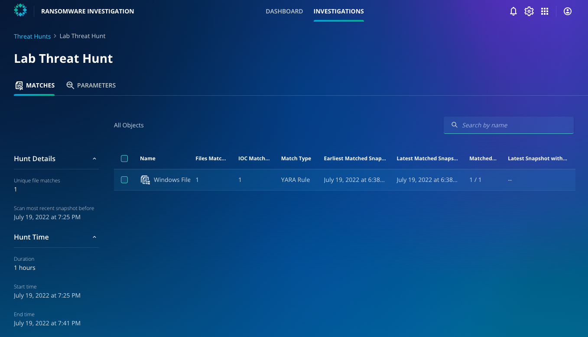

# Review a completed hunt

As your time is precious, we're not going to make you wait for the hunt to complete, and you should see an already completed hunt based on similar criteria in your dashboard. Click into this.

How many IoCs are returned? Where have the IoCs been found in your environment? Can you see what parameters were used for this threat hunt?

Armed with this information, the Zaffre security team can formulate a plan to recover from such an attack now and regularly test their preparedness for any future attacks. How would you use this in your environment?