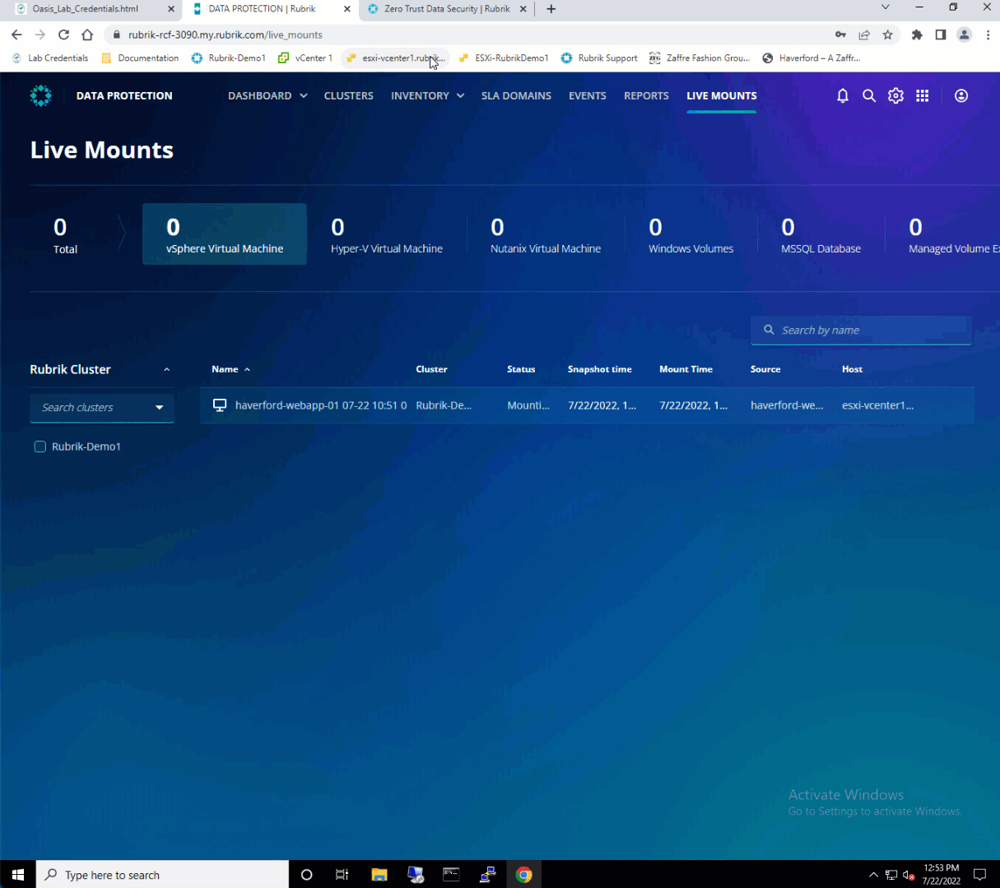

# Forensic investigations

#### The Clean Room Recovery

If an IoC is detected, it may be desirable to mount a snapshot for further forensic investigations. These investigations are usually performed in a Clean Room environment, disconnected from the regular network to protect against the further spread of any potential malware. Rubrik's Live Mount capability is ideal for just such a scenario, allowing any snapshot (including those identified by Threat Monitoring & Hunting) to be instantiated live on the Rubrik cluster. Let's take a look at what this looks like.

Launch **Ransomware Investigation** from the Rubrik Security Cloud app tray to get started. Navigate to the **Investigations** page. Expand the **Haverford_site** blueprint. **Click** on **haverford-webapp-01 VM**.

Click on **Recover Full Snapshot**.

Click **Change Selected Snapshot** to select the infected snapshot in a clean environment. 

Scroll down to select the **snapshot with a yellow circle with an exclamation mark**. Click **Close**.

Click **Next**.

Select **Live Mount** as the recovery option, and click **Next**. 

Select **Cluster** as the destination and click **Next**.

Click **Mount**.

Navigate to **Data Protection** from the app tray and click **Live Mounts** in the top right to verify the mount.

Open a new tab in your browser, and click the shortcut to the **esxi-vcenter1.rubrik.lab**. Login with the credentials on **Lab_Credentials** page. 

After login, select Virtual Machines, and the Live Mount should be mounted as **haverford-webapp-01 %dateofthesnapshot%** such as **haverford-webapp-01 07-22**.

Launch the vSphere Client and log in using the credentials on **Lab_Credentials** page for **haverford-webapp-01**. 

.gif)

Now you can log in to the Live Mounted VM, install your favorite forensic tool, neutralize the malware, and restore to the latest and clean copy.

::: tip Info
Rubrik Threat Monitoring & Hunting enables you to find the snapshot with malware and mount the infected snapshot in a clean room environment instantly without affecting your production environment and neutralize the malware! 
You can then restore to the latest and clean copy of data.
:::