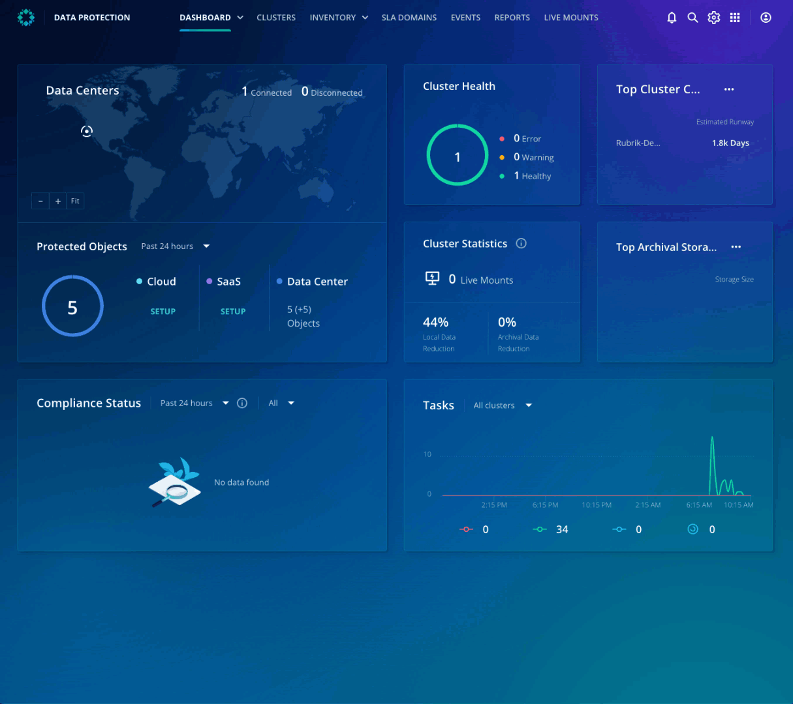
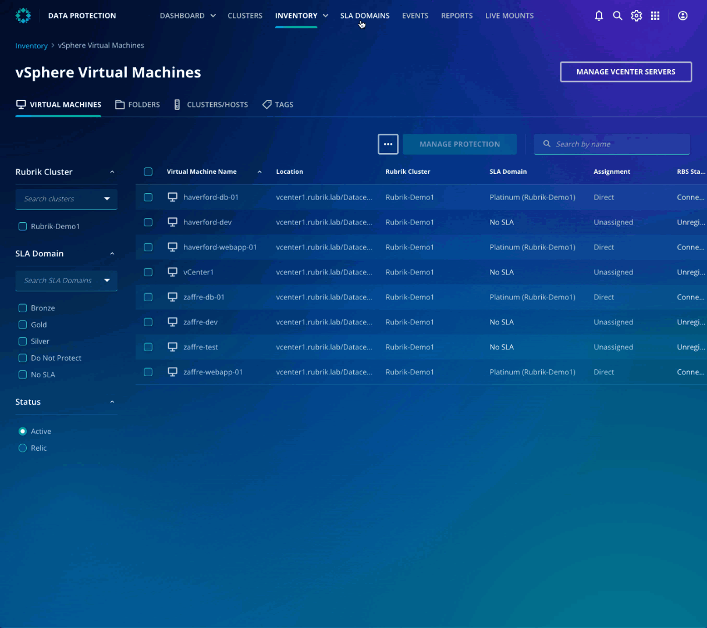
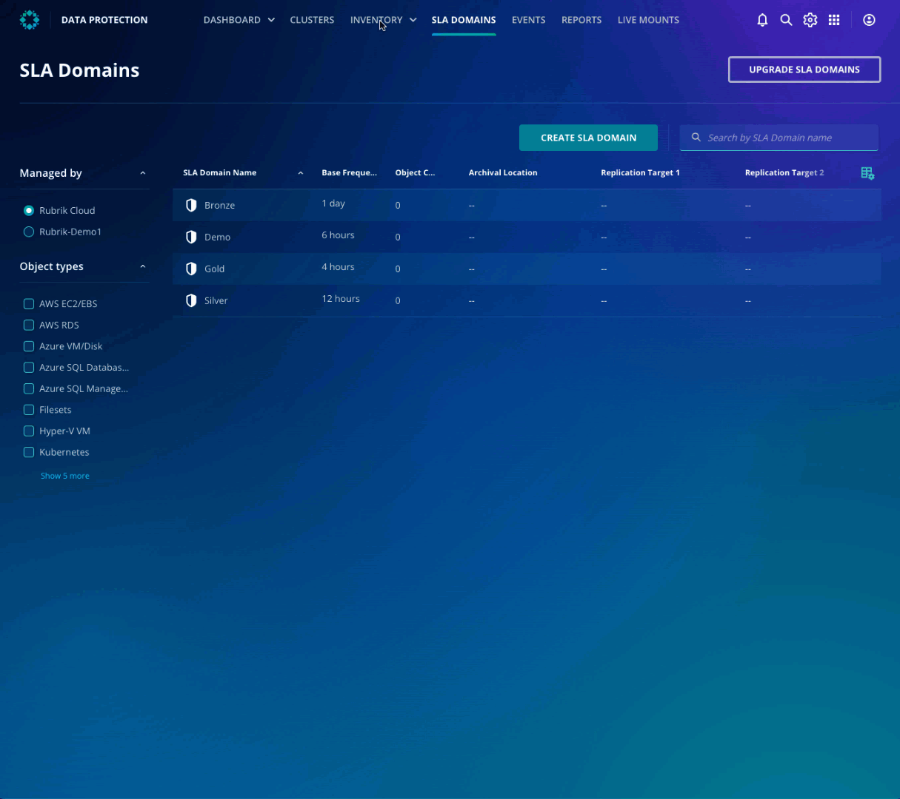
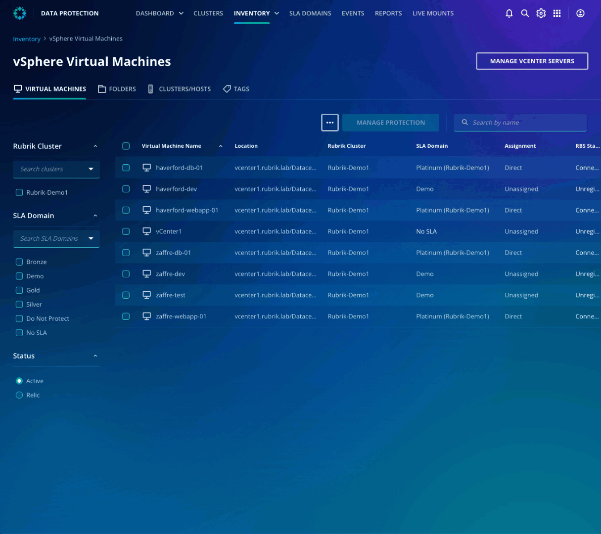

# SLA driven policy engine

To get started on the protection task, take a look at the inventory to ensure you know all the VMs that need to be backed up.

Click **Inventory** from the top ribbon and then **vSphere Virtual Machines**. You can see all the VMs that are protected and unprotected VMs. For now, you can focus on the unprotected VMs: haverford-dev, zaffre-dev, and zaffre-test.

## SLA Domains
By default, there are three SLA domains with RSC: Bronze, silver, and Gold. To protect the VMs, create an SLA domain.

Click **SLA Domains** from the top ribbon and then **CREATE SLA DOMAIN**. Click **CREATE**, select **vSphere VM**, and click **NEXT**. Specify **Every 6 hours** as the frequency, and retain snapshots for 7 day. Keep everything else as default, specify Demo as the SLA Domain name, and click **CREATE**. 

 

## SLA Domain Assignment
Now that you have created the SLA Domain, it's time to assign for you to assign it to the unprotected VMs and ensure it's protected.

To get started, head back to **Inventory** and **vSphere Virtual Machines**. Select haverford-dev, zaffre-dev, zaffre-test and click **MANAGE PROTECTION**. Select **Demo** SLA domain from the list, click **NEXT**, and lastly, click **ASSIGN**.

Now you have completed the SLA Domain assignment.  

## On-demand backup
As an administrator, you need to ensure that you schedule an on-demand backup. 

Select haverford-dev VM from the inventory list. From the top right, click TAKE ON DEMAND SNAPSHOT and leave the rest of the details as defaults. 

Repeat the steps for zaffre-dev and zaffre-test.
::: tip Info
Rubrik’s robust SLA policy engine ensures that data is where it needs to be when it needs to be there, enabling Rubrik to deliver rapid recovery combined with the security provided by encryption and an immutable filesystem.
:::

Excellent job for completing the migration and protection of workloads! Let's make sure you can recover the applications quickly when needed.