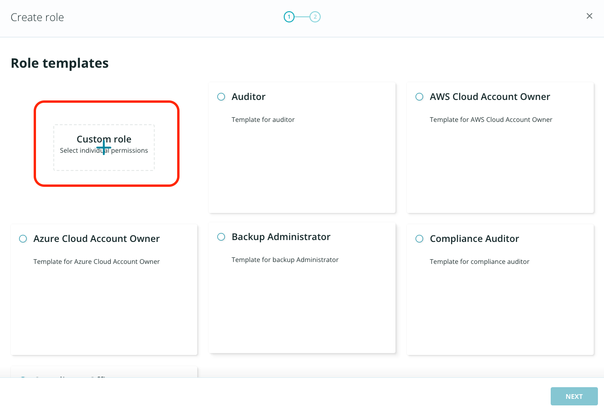

# Role Based Access Control (RBAC)

It is important that you do not give admin privileges to all of the members of the team. Since a new junior administrator is joining your team, you can have a customized role for the new user and add privileges as you see fit. 

## Create Roles and Users

To get started: 

1. From the top right, click on the **gear icon** and navigate to **Users and Roles**.

2. Navigate to **ROLES** and click **CREATE ROLE**.

.png)

3. From the templates, select **Custom role**. 

4. Add a Role name, e.g. Demo. For the **Data Management** role card, select **CONFIGURE**.

5.Select **vSphere** as the **Object type**. Click edit icon for All protectable objects.

6. Select **haverford-dev, zaffre-dev and zaffre-test** and click **Done**.

7. Click **Select all existing and future SLA Domains** and click **Done**.

8. Click **Create**.

9. Ensure that the new role is added under Roles. 

## Assign custom role to new user

Now you can add a new local user and assign the new role. 

1. Click **USERS** and then click **ADD LOCAL USER**. 

.png)

2. Enter **your email** for adding the user so that you can access the email and continue with the new account login. Click **NEXT**.

.png)

3. Select **Demo** as the Role and click **ADD**.

.png)

4. Confirm that the new user is listed with the right role assignment under users.

.png)

5. Logout from RSC.

::: tip Note
1. In a few minutes, you will receive an email from Rubrik Polaris. Please check your SPAM mailbox in case you do not receive it.  If you do not receive the email for an extended period, you can go back to the RSC console and enter your email ID and click on Forgot Password. This will generate an email to your inbox as well.
2. After you log in to RSC with your new role, you will not be able to access all apps, VMs, snapshots, etc., that are part of RSC. 
3. Your inventory access will be limited to three VMs. This can be used to limit access to your environment.
:::

## Verify new role assignment

1. From your email, click **Continue**.

.png)

2. On the webpage, add a new password for the account. 

.png)

3. Login with the new account and accept the terms and conditions as before.

4. Navigate to **Inventory**. 

::: tip Note
You can only see 3 VMs for the new user with the demo role. This can be used to limit access to your environment. 
:::

5. Now, log out of the demo account.

Login to RSC using the regular account credentials mentioned in the [lab environment](../lab_environment/lab-0.md) section.