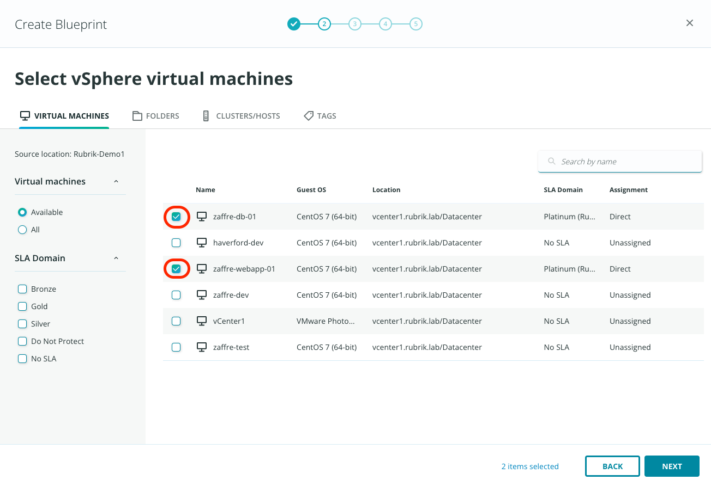

# In-place recovery blueprint

The next task for you is to create a new blueprint through the Rubrik Security Cloud in a few steps to ensure automated recovery of the ZFG applications in case of disaster or ransomware. 

Once you're logged into RSC, click the app-tray icon in the top right of the user interface, then select Application Recovery.

Click the **Create Blueprint** button. 

You will be taken into the wizard as shown below.  Specify the Name as **Demo** and select the **Rubrik-Demo1** as Source Cluster. It is optional to enable failover. If you have a remote site for disaster recovery, you can enable failover. For now, keep it disables and click **Next**.

Select **zaffre-webapp-01** and **zaffre-db-01**, then click **Next**.

Select the **priority group** for the boot order of the virtual machine and click **Next**.

You can add the path to scripts to run on the virtual machine after failover. This is optional. For now, click **Next**.

Review the details and click **Create**.

Click CLOSE after the blueprint is created.

Explore the different tabs for the blueprint. After reviewing the details, click on Blueprint on the top left to see the list of all the blueprints

::: warning CAUTION
A VM may only be a member of one Blueprint at any given time.  This is by design as failover or in-place recovery actions may be executed against more than one Blueprint at a time.  In later releases of Orchestrated Application Recovery, it is planned to allow more coordinated orchestration across multiple Blueprints at once to ensure applications may be failed over or locally recovered in a specific order to better accommodate any interdependencies they may have with one another.  Once a VM is added to a Blueprint, it will no longer show up as an available selection during subsequent Blueprint creation actions.
:::

::: tip Note
Blueprints can be scaled to 100s of VMs to enable fast VM recovery across sites or in place. Post recovery scripts can be added to automate the VM and application changes. 
:::